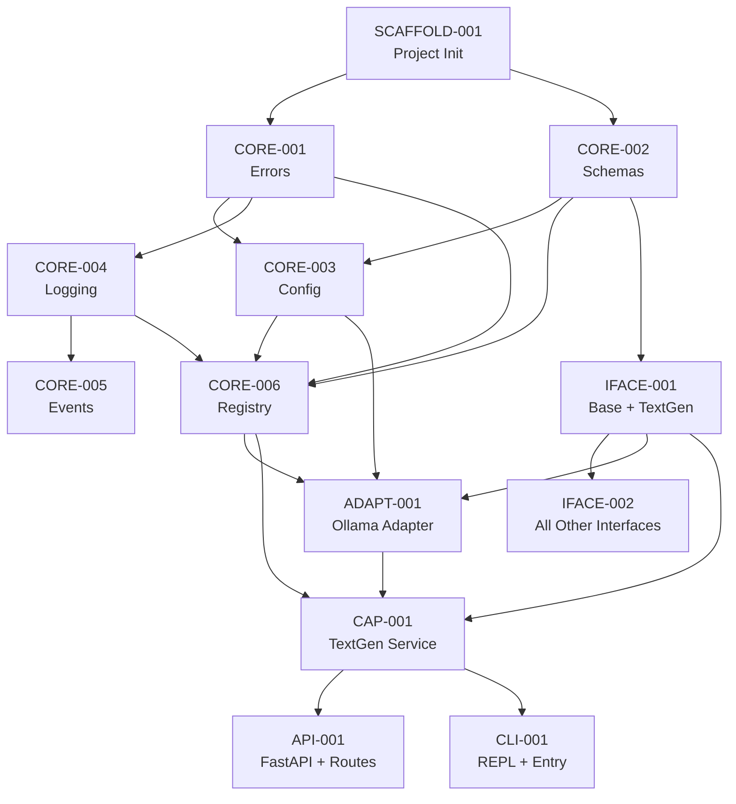

# ProjectX — Implementation Stories

> **For coding agents**: Each story is self-contained. Read PROJECTX.md first for context,
> then pick ONE story by ID. Create only the files listed. Pass all test cases listed.
> Do not modify files outside your story's scope.

---

## How To Use This File

1. **Agent reads** `PROJECTX.md` (compact context — ~100 lines)
2. **Agent picks** one story from this file by ID (e.g., `CORE-001`)
3. **Story contains**: description, files to create, exact interfaces, test cases
4. **Done when**: all tests pass, ruff check passes, ruff format passes

### Story Status Key

- ⬜ Not started
- 🟡 In progress
- ✅ Done

---

# EPIC 1: PROJECT SCAFFOLDING

## ✅ SCAFFOLD-001: Initialize Python Project

**Goal**: Create the project skeleton with uv, pyproject.toml, and empty packages.

**Files to create**:
```
pyproject.toml
src/projectx/__init__.py
src/projectx/core/__init__.py
src/projectx/interfaces/__init__.py
src/projectx/adapters/__init__.py
src/projectx/capabilities/__init__.py
src/projectx/orchestration/__init__.py
src/projectx/api/__init__.py
src/projectx/cli/__init__.py
tests/__init__.py
tests/unit/__init__.py
tests/integration/__init__.py
tests/conftest.py
config/default.yaml
config/providers.yaml
```

**pyproject.toml spec**:
```toml
[project]
name = "projectx"
version = "0.1.0"
description = "Modular, provider-agnostic AI platform"
requires-python = ">=3.12"
dependencies = [
    "pydantic>=2.0,<3.0",
    "pydantic-settings>=2.0,<3.0",
    "pyyaml>=6.0",
    "structlog>=24.0",
    "httpx>=0.27",
    "aiofiles>=24.0",
    "aiosqlite>=0.20",
]

[project.optional-dependencies]
api = ["fastapi>=0.115", "uvicorn[standard]>=0.30"]
cli = ["textual>=0.80", "rich>=13.0", "typer>=0.12"]
dev = ["pytest>=8.0", "pytest-asyncio>=0.24", "ruff>=0.6"]
all = ["projectx[api,cli,dev]"]

[build-system]
requires = ["hatchling"]
build-backend = "hatchling.build"

[tool.hatch.build.targets.wheel]
packages = ["src/projectx"]

[tool.pytest.ini_options]
asyncio_mode = "auto"
testpaths = ["tests"]
pythonpath = ["src"]

[tool.ruff]
target-version = "py312"
src = ["src", "tests"]

[tool.ruff.lint]
select = ["E", "F", "I", "UP", "B", "SIM"]
```

**config/default.yaml**:
```yaml
app:
  name: projectx
  version: 0.1.0
  log_level: INFO
  data_dir: ~/.projectx

storage:
  backend: local
  local:
    base_path: ~/.projectx/storage

cache:
  backend: memory
  ttl_seconds: 3600
```

**config/providers.yaml**:
```yaml
providers:
  text_generation:
    default: ollama
    fallback: null
    adapters:
      ollama:
        base_url: http://localhost:11434
        default_model: llama3.2
        timeout: 120
```

**tests/conftest.py**:
```python
import pytest

@pytest.fixture
def sample_config():
    return {
        "app": {"name": "projectx-test", "version": "0.1.0", "log_level": "DEBUG", "data_dir": "/tmp/projectx-test"},
        "storage": {"backend": "local", "local": {"base_path": "/tmp/projectx-test/storage"}},
        "cache": {"backend": "memory", "ttl_seconds": 60},
    }
```

**Acceptance criteria**:
```bash
# All must pass
uv sync --all-extras
uv run python -c "import projectx; print('OK')"
uv run pytest --collect-only  # discovers tests dir
uv run ruff check src/ tests/
```

---

# EPIC 2: CORE LAYER (Layer 0)

> Layer 0 knows NOTHING about AI. It provides infrastructure.

## ✅ CORE-001: Error Hierarchy

**Goal**: Create typed error classes used by all layers.

**Files to create**:
```
src/projectx/core/errors.py
tests/unit/core/__init__.py
tests/unit/core/test_errors.py
```

**src/projectx/core/errors.py** — implement exactly:
```python
"""Typed error hierarchy for ProjectX.

All errors inherit from ProjectXError. Each layer has specific error types.
Never raise bare Exception — always use these.
"""


class ProjectXError(Exception):
    """Base error for all ProjectX errors."""

    def __init__(self, message: str, details: dict | None = None):
        self.message = message
        self.details = details or {}
        super().__init__(self.message)


class ConfigError(ProjectXError):
    """Error loading or validating configuration."""


class AdapterError(ProjectXError):
    """Base error for adapter-layer issues."""


class AdapterNotFoundError(AdapterError):
    """Requested adapter is not registered."""

    def __init__(self, adapter_name: str, capability: str):
        super().__init__(
            f"Adapter '{adapter_name}' not found for capability '{capability}'",
            details={"adapter": adapter_name, "capability": capability},
        )


class AdapterConnectionError(AdapterError):
    """Cannot connect to the adapter's backend (API, local model, etc.)."""


class AdapterResponseError(AdapterError):
    """Adapter returned an unexpected or invalid response."""


class CapabilityError(ProjectXError):
    """Base error for capability-layer issues."""


class CapabilityNotAvailableError(CapabilityError):
    """Requested capability has no registered adapter."""

    def __init__(self, capability: str):
        super().__init__(
            f"No adapter registered for capability '{capability}'",
            details={"capability": capability},
        )


class CapabilityExecutionError(CapabilityError):
    """Error during capability execution."""


class PipelineError(ProjectXError):
    """Error in pipeline definition or execution."""


class ValidationError(ProjectXError):
    """Data validation error."""
```

**Test cases** — tests/unit/core/test_errors.py:
```python
"""Tests for projectx.core.errors."""
import pytest
from projectx.core.errors import (
    ProjectXError,
    ConfigError,
    AdapterError,
    AdapterNotFoundError,
    AdapterConnectionError,
    AdapterResponseError,
    CapabilityError,
    CapabilityNotAvailableError,
    CapabilityExecutionError,
    PipelineError,
    ValidationError,
)


class TestErrorHierarchy:
    """Verify inheritance chain is correct."""

    def test_all_errors_inherit_from_projectx_error(self):
        error_classes = [
            ConfigError, AdapterError, AdapterNotFoundError,
            AdapterConnectionError, AdapterResponseError,
            CapabilityError, CapabilityNotAvailableError,
            CapabilityExecutionError, PipelineError, ValidationError,
        ]
        for cls in error_classes:
            assert issubclass(cls, ProjectXError)

    def test_adapter_errors_inherit_from_adapter_error(self):
        assert issubclass(AdapterNotFoundError, AdapterError)
        assert issubclass(AdapterConnectionError, AdapterError)
        assert issubclass(AdapterResponseError, AdapterError)

    def test_capability_errors_inherit_from_capability_error(self):
        assert issubclass(CapabilityNotAvailableError, CapabilityError)
        assert issubclass(CapabilityExecutionError, CapabilityError)


class TestErrorDetails:
    """Verify error instances carry correct data."""

    def test_base_error_has_message_and_details(self):
        err = ProjectXError("something broke", details={"key": "val"})
        assert err.message == "something broke"
        assert err.details == {"key": "val"}
        assert str(err) == "something broke"

    def test_base_error_defaults_empty_details(self):
        err = ProjectXError("oops")
        assert err.details == {}

    def test_adapter_not_found_formats_message(self):
        err = AdapterNotFoundError(adapter_name="ollama", capability="text_generation")
        assert "ollama" in err.message
        assert "text_generation" in err.message
        assert err.details["adapter"] == "ollama"
        assert err.details["capability"] == "text_generation"

    def test_capability_not_available_formats_message(self):
        err = CapabilityNotAvailableError(capability="speech_to_text")
        assert "speech_to_text" in err.message
        assert err.details["capability"] == "speech_to_text"

    def test_errors_are_catchable_by_parent(self):
        with pytest.raises(ProjectXError):
            raise AdapterNotFoundError("x", "y")

        with pytest.raises(AdapterError):
            raise AdapterConnectionError("connection refused")
```

**Acceptance**: `uv run pytest tests/unit/core/test_errors.py -v` — all pass.

---

## ✅ CORE-002: Base Schemas

**Goal**: Pydantic base models shared across all layers.

**Depends on**: CORE-001

**Files to create**:
```
src/projectx/core/schemas.py
tests/unit/core/test_schemas.py
```

**src/projectx/core/schemas.py** — implement exactly:
```python
"""Base Pydantic models shared across all layers."""
from __future__ import annotations

from datetime import datetime
from enum import StrEnum
from typing import Any
from uuid import UUID, uuid4

from pydantic import BaseModel, Field


class Capability(StrEnum):
    """All supported AI capabilities."""
    TEXT_GENERATION = "text_generation"
    VISION = "vision"
    SPEECH_TO_TEXT = "speech_to_text"
    TEXT_TO_SPEECH = "text_to_speech"
    IMAGE_GENERATION = "image_generation"
    IMAGE_TO_3D = "image_to_3d"
    CODE_GENERATION = "code_generation"
    EMBEDDINGS = "embeddings"
    RAG = "rag"
    AGENT = "agent"


class ModelInfo(BaseModel):
    """Metadata about a model available through an adapter."""
    name: str
    provider: str
    capability: Capability
    context_window: int | None = None
    max_output_tokens: int | None = None
    supports_streaming: bool = False
    supports_vision: bool = False
    cost_per_input_token: float = 0.0
    cost_per_output_token: float = 0.0


class TokenUsage(BaseModel):
    """Token usage for a single request."""
    input_tokens: int = 0
    output_tokens: int = 0
    total_tokens: int = 0

    def __add__(self, other: TokenUsage) -> TokenUsage:
        return TokenUsage(
            input_tokens=self.input_tokens + other.input_tokens,
            output_tokens=self.output_tokens + other.output_tokens,
            total_tokens=self.total_tokens + other.total_tokens,
        )


class RequestMetadata(BaseModel):
    """Metadata attached to every request flowing through the system."""
    request_id: UUID = Field(default_factory=uuid4)
    timestamp: datetime = Field(default_factory=datetime.utcnow)
    provider: str | None = None
    model: str | None = None
    capability: Capability | None = None
    extra: dict[str, Any] = Field(default_factory=dict)


class AdapterManifest(BaseModel):
    """Declares what an adapter supports. Every adapter must expose one."""
    name: str
    version: str = "0.1.0"
    capabilities: list[Capability]
    supports_streaming: bool = False
    supports_local: bool = False
    requires_api_key: bool = False
    default_models: dict[Capability, str] = Field(default_factory=dict)
```

**Test cases** — tests/unit/core/test_schemas.py:
```python
"""Tests for projectx.core.schemas."""
from projectx.core.schemas import (
    Capability,
    ModelInfo,
    TokenUsage,
    RequestMetadata,
    AdapterManifest,
)


class TestCapabilityEnum:
    def test_all_capabilities_exist(self):
        expected = {
            "text_generation", "vision", "speech_to_text", "text_to_speech",
            "image_generation", "image_to_3d", "code_generation",
            "embeddings", "rag", "agent",
        }
        assert {c.value for c in Capability} == expected

    def test_capability_is_string(self):
        assert Capability.TEXT_GENERATION == "text_generation"
        assert isinstance(Capability.VISION, str)


class TestTokenUsage:
    def test_defaults_to_zero(self):
        usage = TokenUsage()
        assert usage.input_tokens == 0
        assert usage.output_tokens == 0

    def test_addition(self):
        a = TokenUsage(input_tokens=10, output_tokens=20, total_tokens=30)
        b = TokenUsage(input_tokens=5, output_tokens=10, total_tokens=15)
        result = a + b
        assert result.input_tokens == 15
        assert result.output_tokens == 30
        assert result.total_tokens == 45


class TestModelInfo:
    def test_create_with_defaults(self):
        info = ModelInfo(
            name="llama3.2",
            provider="ollama",
            capability=Capability.TEXT_GENERATION,
        )
        assert info.name == "llama3.2"
        assert info.cost_per_input_token == 0.0
        assert info.supports_streaming is False

    def test_create_with_all_fields(self):
        info = ModelInfo(
            name="gpt-4o",
            provider="openai",
            capability=Capability.TEXT_GENERATION,
            context_window=128000,
            max_output_tokens=4096,
            supports_streaming=True,
            supports_vision=True,
            cost_per_input_token=0.005,
            cost_per_output_token=0.015,
        )
        assert info.context_window == 128000
        assert info.supports_vision is True


class TestRequestMetadata:
    def test_auto_generates_id_and_timestamp(self):
        meta = RequestMetadata()
        assert meta.request_id is not None
        assert meta.timestamp is not None

    def test_two_requests_have_different_ids(self):
        a = RequestMetadata()
        b = RequestMetadata()
        assert a.request_id != b.request_id


class TestAdapterManifest:
    def test_minimal_manifest(self):
        manifest = AdapterManifest(
            name="ollama",
            capabilities=[Capability.TEXT_GENERATION, Capability.EMBEDDINGS],
        )
        assert manifest.name == "ollama"
        assert len(manifest.capabilities) == 2
        assert manifest.requires_api_key is False

    def test_manifest_with_defaults(self):
        manifest = AdapterManifest(
            name="openai",
            capabilities=[Capability.TEXT_GENERATION],
            requires_api_key=True,
            default_models={Capability.TEXT_GENERATION: "gpt-4o"},
        )
        assert manifest.default_models[Capability.TEXT_GENERATION] == "gpt-4o"
```

**Acceptance**: `uv run pytest tests/unit/core/test_schemas.py -v` — all pass.

---

## ✅ CORE-003: Config Manager

**Goal**: Load config from YAML files with environment variable substitution and validation.

**Depends on**: CORE-001, CORE-002

**Files to create**:
```
src/projectx/core/config.py
tests/unit/core/test_config.py
```

**Behavior spec**:
1. Load `config/default.yaml` as base config
2. Deep-merge `config/providers.yaml` on top
3. Substitute `${ENV_VAR}` patterns with environment variables
4. Validate with Pydantic
5. Provide `get_config()` singleton accessor
6. Support hot-reload via `reload_config()`

**Interface contract**:
```python
def load_config(config_dir: str | Path | None = None, overrides: dict | None = None) -> ProjectXConfig: ...
def get_config() -> ProjectXConfig: ...
def reload_config(config_dir: str | Path | None = None) -> ProjectXConfig: ...
def reset_config() -> None: ...  # For testing
def _substitute_env_vars(data: Any) -> Any: ...  # ${VAR} → os.environ[VAR]
def _deep_merge(base: dict, override: dict) -> dict: ...  # Deep merge dicts
```

**Pydantic models to define**:
- `AppConfig` — name, version, log_level, data_dir
- `StorageConfig` — backend, local settings
- `CacheConfig` — backend, ttl_seconds
- `ProviderAdapterConfig` — base_url, api_key, default_model, timeout, extra dict
- `ProviderCapabilityConfig` — default provider, fallback, adapters dict
- `ProjectXConfig` — root model combining all above

**Test cases** — tests/unit/core/test_config.py:
```python
"""Tests for projectx.core.config."""
import os
from pathlib import Path

import pytest
import yaml

from projectx.core.config import (
    ProjectXConfig,
    load_config,
    reset_config,
    _substitute_env_vars,
    _deep_merge,
)
from projectx.core.errors import ConfigError


@pytest.fixture(autouse=True)
def _reset():
    reset_config()
    yield
    reset_config()


@pytest.fixture
def config_dir(tmp_path):
    default = tmp_path / "default.yaml"
    default.write_text(yaml.dump({
        "app": {"name": "test-app", "version": "0.1.0", "log_level": "DEBUG", "data_dir": "/tmp/test"},
        "storage": {"backend": "local", "local": {"base_path": "/tmp/test/storage"}},
        "cache": {"backend": "memory", "ttl_seconds": 60},
    }))
    providers = tmp_path / "providers.yaml"
    providers.write_text(yaml.dump({
        "providers": {
            "text_generation": {
                "default": "ollama",
                "fallback": None,
                "adapters": {
                    "ollama": {
                        "base_url": "http://localhost:11434",
                        "default_model": "llama3.2",
                        "timeout": 120,
                    }
                }
            }
        }
    }))
    return tmp_path


class TestEnvVarSubstitution:
    def test_substitutes_existing_var(self, monkeypatch):
        monkeypatch.setenv("MY_KEY", "secret123")
        result = _substitute_env_vars({"api_key": "${MY_KEY}"})
        assert result["api_key"] == "secret123"

    def test_leaves_unresolved_var(self):
        result = _substitute_env_vars({"api_key": "${NONEXISTENT_VAR}"})
        assert result["api_key"] == "${NONEXISTENT_VAR}"

    def test_handles_nested_dicts(self, monkeypatch):
        monkeypatch.setenv("HOST", "localhost")
        result = _substitute_env_vars({"server": {"host": "${HOST}"}})
        assert result["server"]["host"] == "localhost"

    def test_handles_lists(self, monkeypatch):
        monkeypatch.setenv("ITEM", "value")
        result = _substitute_env_vars(["${ITEM}", "static"])
        assert result == ["value", "static"]

    def test_leaves_non_strings_alone(self):
        assert _substitute_env_vars(42) == 42
        assert _substitute_env_vars(True) is True


class TestDeepMerge:
    def test_flat_merge(self):
        assert _deep_merge({"a": 1}, {"b": 2}) == {"a": 1, "b": 2}

    def test_override_wins(self):
        assert _deep_merge({"a": 1}, {"a": 2}) == {"a": 2}

    def test_nested_merge(self):
        base = {"a": {"x": 1, "y": 2}}
        override = {"a": {"y": 3, "z": 4}}
        assert _deep_merge(base, override) == {"a": {"x": 1, "y": 3, "z": 4}}

    def test_does_not_mutate_base(self):
        base = {"a": 1}
        _deep_merge(base, {"b": 2})
        assert base == {"a": 1}


class TestLoadConfig:
    def test_loads_from_directory(self, config_dir):
        config = load_config(config_dir)
        assert config.app.name == "test-app"
        assert config.app.log_level == "DEBUG"

    def test_merges_providers(self, config_dir):
        config = load_config(config_dir)
        assert "text_generation" in config.providers
        tg = config.providers["text_generation"]
        assert tg.default == "ollama"
        assert "ollama" in tg.adapters
        assert tg.adapters["ollama"].base_url == "http://localhost:11434"

    def test_overrides_applied(self, config_dir):
        config = load_config(config_dir, overrides={"app": {"log_level": "WARNING"}})
        assert config.app.log_level == "WARNING"

    def test_env_var_substitution_in_providers(self, config_dir, monkeypatch):
        monkeypatch.setenv("TEST_API_KEY", "sk-test-123")
        providers_path = config_dir / "providers.yaml"
        providers_path.write_text(yaml.dump({
            "providers": {
                "text_generation": {
                    "default": "openai",
                    "adapters": {
                        "openai": {"api_key": "${TEST_API_KEY}", "default_model": "gpt-4o"}
                    }
                }
            }
        }))
        config = load_config(config_dir)
        assert config.providers["text_generation"].adapters["openai"].api_key == "sk-test-123"

    def test_empty_config_dir_returns_defaults(self, tmp_path):
        config = load_config(tmp_path)
        assert config.app.name == "projectx"

    def test_invalid_yaml_raises_config_error(self, tmp_path):
        bad_file = tmp_path / "default.yaml"
        bad_file.write_text("{{invalid yaml: [")
        with pytest.raises(ConfigError):
            load_config(tmp_path)
```

**Acceptance**: `uv run pytest tests/unit/core/test_config.py -v` — all pass.

---

## ✅ CORE-004: Structured Logging

**Goal**: structlog-based logger with correlation IDs.

**Depends on**: CORE-001

**Files to create**:
```
src/projectx/core/logging.py
tests/unit/core/test_logging.py
```

**Interface contract**:
```python
def configure_logging(log_level: str = "INFO", json_output: bool = False) -> None: ...
def get_logger(name: str) -> structlog.stdlib.BoundLogger: ...
def bind_context(**kwargs) -> None: ...
def clear_context() -> None: ...
```

**Behavior**:
- `configure_logging()` sets up structlog with stdlib integration, is idempotent (only configures once)
- `get_logger(name)` returns a bound structlog logger, auto-calls configure if needed
- `bind_context()` uses `structlog.contextvars` to add key-value pairs visible in all subsequent logs
- `clear_context()` clears all context bindings

**Test cases** — tests/unit/core/test_logging.py:
```python
"""Tests for projectx.core.logging."""
import projectx.core.logging as log_module
from projectx.core.logging import get_logger, configure_logging, bind_context, clear_context


class TestGetLogger:
    def test_returns_bound_logger(self):
        log_module._configured = False
        logger = get_logger("test.module")
        assert logger is not None
        assert callable(getattr(logger, "info", None))
        assert callable(getattr(logger, "error", None))
        assert callable(getattr(logger, "debug", None))

    def test_logger_does_not_crash_on_log(self):
        log_module._configured = False
        logger = get_logger("test.safe")
        logger.info("test message", key="value")
        logger.debug("debug message")
        logger.warning("warning message")


class TestConfigureLogging:
    def test_configure_is_idempotent(self):
        log_module._configured = False
        configure_logging("DEBUG")
        configure_logging("DEBUG")
        assert log_module._configured is True

    def test_configure_json_mode(self):
        log_module._configured = False
        configure_logging("INFO", json_output=True)
        logger = get_logger("json.test")
        logger.info("json test")


class TestContext:
    def test_bind_and_clear(self):
        clear_context()
        bind_context(request_id="abc-123")
        clear_context()
```

**Acceptance**: `uv run pytest tests/unit/core/test_logging.py -v` — all pass.

---

## ✅ CORE-005: Event Bus

**Goal**: Simple in-process async event bus for decoupled communication.

**Depends on**: CORE-004

**Files to create**:
```
src/projectx/core/events.py
tests/unit/core/test_events.py
```

**Interface contract**:
```python
@dataclass
class Event:
    name: str
    data: dict[str, Any]
    timestamp: datetime

class EventBus:
    def on(self, event_name: str, handler: EventHandler) -> None: ...
    def off(self, event_name: str, handler: EventHandler) -> None: ...
    async def emit(self, event: Event) -> None: ...  # Concurrent handler execution, errors isolated
    def get_history(self, event_name: str | None = None) -> list[Event]: ...
    def clear(self) -> None: ...
```

**Behavior**:
- `on("*", handler)` — wildcard listener receives all events
- `emit()` — runs all matching handlers concurrently via `asyncio.gather`
- Handler errors are logged but don't affect other handlers
- Event history capped at 1000

**Test cases** — tests/unit/core/test_events.py:
```python
"""Tests for projectx.core.events."""
import pytest
from projectx.core.events import Event, EventBus


@pytest.fixture
def bus():
    return EventBus()


class TestEvent:
    def test_event_has_name_and_data(self):
        event = Event(name="test.event", data={"key": "value"})
        assert event.name == "test.event"
        assert event.data["key"] == "value"
        assert event.timestamp is not None

    def test_event_defaults_empty_data(self):
        event = Event(name="empty")
        assert event.data == {}


class TestEventBus:
    async def test_handler_receives_event(self, bus):
        received = []
        async def handler(event: Event):
            received.append(event)
        bus.on("test", handler)
        await bus.emit(Event(name="test", data={"x": 1}))
        assert len(received) == 1
        assert received[0].data["x"] == 1

    async def test_multiple_handlers(self, bus):
        calls = []
        async def handler_a(event): calls.append("a")
        async def handler_b(event): calls.append("b")
        bus.on("multi", handler_a)
        bus.on("multi", handler_b)
        await bus.emit(Event(name="multi"))
        assert set(calls) == {"a", "b"}

    async def test_wildcard_handler(self, bus):
        received = []
        async def handler(event): received.append(event.name)
        bus.on("*", handler)
        await bus.emit(Event(name="foo"))
        await bus.emit(Event(name="bar"))
        assert received == ["foo", "bar"]

    async def test_off_removes_handler(self, bus):
        calls = []
        async def handler(event): calls.append(1)
        bus.on("test", handler)
        bus.off("test", handler)
        await bus.emit(Event(name="test"))
        assert calls == []

    async def test_handler_error_does_not_break_others(self, bus):
        results = []
        async def bad_handler(event): raise ValueError("boom")
        async def good_handler(event): results.append("ok")
        bus.on("test", bad_handler)
        bus.on("test", good_handler)
        await bus.emit(Event(name="test"))
        assert results == ["ok"]

    async def test_no_handlers_does_not_error(self, bus):
        await bus.emit(Event(name="nobody.listens"))

    async def test_event_history(self, bus):
        await bus.emit(Event(name="a"))
        await bus.emit(Event(name="b"))
        await bus.emit(Event(name="a"))
        assert len(bus.get_history()) == 3
        assert len(bus.get_history("a")) == 2

    async def test_clear_removes_everything(self, bus):
        async def handler(event): pass
        bus.on("test", handler)
        await bus.emit(Event(name="test"))
        bus.clear()
        assert bus.get_history() == []
```

**Acceptance**: `uv run pytest tests/unit/core/test_events.py -v` — all pass.

---

## ✅ CORE-006: Adapter Registry

**Goal**: Registry that discovers, stores, and retrieves adapter instances by capability.

**Depends on**: CORE-001, CORE-002, CORE-003, CORE-004

**Files to create**:
```
src/projectx/core/registry.py
tests/unit/core/test_registry.py
```

**Interface contract**:
```python
class AdapterRegistry:
    def register(self, adapter: Any, manifest: AdapterManifest) -> None: ...
    def unregister(self, name: str) -> None: ...
    def set_default(self, capability: Capability, provider: str) -> None: ...
    def set_fallback(self, capability: Capability, provider: str) -> None: ...
    def get_adapter(self, capability: Capability, provider: str | None = None) -> Any: ...
    # Resolution: explicit provider → default → first match → CapabilityNotAvailableError
    def get_fallback_adapter(self, capability: Capability) -> Any | None: ...
    def list_adapters(self) -> list[AdapterManifest]: ...
    def list_adapters_for_capability(self, capability: Capability) -> list[str]: ...
    def has_capability(self, capability: Capability) -> bool: ...
```

**Test cases** — tests/unit/core/test_registry.py:
```python
"""Tests for projectx.core.registry."""
import pytest
from projectx.core.registry import AdapterRegistry
from projectx.core.schemas import AdapterManifest, Capability
from projectx.core.errors import AdapterNotFoundError, CapabilityNotAvailableError


class FakeAdapter:
    def __init__(self, name: str):
        self.name = name


@pytest.fixture
def registry():
    return AdapterRegistry()


@pytest.fixture
def ollama_adapter():
    return FakeAdapter("ollama")

@pytest.fixture
def ollama_manifest():
    return AdapterManifest(
        name="ollama",
        capabilities=[Capability.TEXT_GENERATION, Capability.EMBEDDINGS],
        supports_streaming=True, supports_local=True,
    )

@pytest.fixture
def openai_adapter():
    return FakeAdapter("openai")

@pytest.fixture
def openai_manifest():
    return AdapterManifest(
        name="openai",
        capabilities=[Capability.TEXT_GENERATION, Capability.VISION, Capability.IMAGE_GENERATION],
        requires_api_key=True,
    )


class TestRegister:
    def test_register_adapter(self, registry, ollama_adapter, ollama_manifest):
        registry.register(ollama_adapter, ollama_manifest)
        assert len(registry.list_adapters()) == 1

    def test_register_multiple(self, registry, ollama_adapter, ollama_manifest, openai_adapter, openai_manifest):
        registry.register(ollama_adapter, ollama_manifest)
        registry.register(openai_adapter, openai_manifest)
        assert len(registry.list_adapters()) == 2

    def test_unregister(self, registry, ollama_adapter, ollama_manifest):
        registry.register(ollama_adapter, ollama_manifest)
        registry.unregister("ollama")
        assert len(registry.list_adapters()) == 0


class TestGetAdapter:
    def test_get_by_capability(self, registry, ollama_adapter, ollama_manifest):
        registry.register(ollama_adapter, ollama_manifest)
        result = registry.get_adapter(Capability.TEXT_GENERATION)
        assert result is ollama_adapter

    def test_get_by_explicit_provider(self, registry, ollama_adapter, ollama_manifest, openai_adapter, openai_manifest):
        registry.register(ollama_adapter, ollama_manifest)
        registry.register(openai_adapter, openai_manifest)
        result = registry.get_adapter(Capability.TEXT_GENERATION, provider="openai")
        assert result is openai_adapter

    def test_get_default_preferred(self, registry, ollama_adapter, ollama_manifest, openai_adapter, openai_manifest):
        registry.register(ollama_adapter, ollama_manifest)
        registry.register(openai_adapter, openai_manifest)
        registry.set_default(Capability.TEXT_GENERATION, "openai")
        result = registry.get_adapter(Capability.TEXT_GENERATION)
        assert result is openai_adapter

    def test_explicit_provider_not_found_raises(self, registry):
        with pytest.raises(AdapterNotFoundError):
            registry.get_adapter(Capability.TEXT_GENERATION, provider="nonexistent")

    def test_no_adapter_for_capability_raises(self, registry, ollama_adapter, ollama_manifest):
        registry.register(ollama_adapter, ollama_manifest)
        with pytest.raises(CapabilityNotAvailableError):
            registry.get_adapter(Capability.IMAGE_GENERATION)

    def test_provider_missing_capability_raises(self, registry, ollama_adapter, ollama_manifest):
        registry.register(ollama_adapter, ollama_manifest)
        with pytest.raises(AdapterNotFoundError):
            registry.get_adapter(Capability.VISION, provider="ollama")


class TestDefaults:
    def test_set_default_nonexistent_raises(self, registry):
        with pytest.raises(AdapterNotFoundError):
            registry.set_default(Capability.TEXT_GENERATION, "ghost")

    def test_unregister_cleans_defaults(self, registry, ollama_adapter, ollama_manifest):
        registry.register(ollama_adapter, ollama_manifest)
        registry.set_default(Capability.TEXT_GENERATION, "ollama")
        registry.unregister("ollama")
        with pytest.raises(CapabilityNotAvailableError):
            registry.get_adapter(Capability.TEXT_GENERATION)


class TestFallback:
    def test_get_fallback(self, registry, ollama_adapter, ollama_manifest):
        registry.register(ollama_adapter, ollama_manifest)
        registry.set_fallback(Capability.TEXT_GENERATION, "ollama")
        assert registry.get_fallback_adapter(Capability.TEXT_GENERATION) is ollama_adapter

    def test_get_fallback_returns_none(self, registry):
        assert registry.get_fallback_adapter(Capability.TEXT_GENERATION) is None


class TestListAndQuery:
    def test_list_for_capability(self, registry, ollama_adapter, ollama_manifest, openai_adapter, openai_manifest):
        registry.register(ollama_adapter, ollama_manifest)
        registry.register(openai_adapter, openai_manifest)
        names = registry.list_adapters_for_capability(Capability.TEXT_GENERATION)
        assert set(names) == {"ollama", "openai"}

    def test_has_capability(self, registry, ollama_adapter, ollama_manifest):
        registry.register(ollama_adapter, ollama_manifest)
        assert registry.has_capability(Capability.TEXT_GENERATION) is True
        assert registry.has_capability(Capability.IMAGE_GENERATION) is False
```

**Acceptance**: `uv run pytest tests/unit/core/test_registry.py -v` — all pass.

---

# EPIC 3: INTERFACE LAYER

## ✅ IFACE-001: Base Interface + Text Generation Interface

**Goal**: Define the base adapter ABC and text generation interface.

**Depends on**: CORE-002

**Files to create**:
```
src/projectx/interfaces/base.py
src/projectx/interfaces/text_generation.py
tests/unit/interfaces/__init__.py
tests/unit/interfaces/test_text_generation.py
```

**Contracts**: See PROJECTX.md "Adapter Pattern" section for the exact pattern. Text generation interface must define:
- `TextGenRequest` — prompt, system_prompt, model, max_tokens, temperature, top_p, stop_sequences, response_format
- `TextGenResponse` — content, model, usage (TokenUsage), finish_reason
- `TextChunk` — content, finish_reason, usage (for streaming)
- `TextGenerationInterface(ABC)` — `generate()`, `generate_stream()`, `get_supported_models()`
- `BaseAdapter(ABC)` — `get_manifest()`, `health_check()`, `initialize()`, `shutdown()`

**Test cases** — tests/unit/interfaces/test_text_generation.py:
```python
"""Tests for text generation interface contracts."""
import pytest
from projectx.interfaces.text_generation import (
    TextGenRequest, TextGenResponse, TextChunk, TextGenerationInterface,
)
from projectx.core.schemas import TokenUsage


class TestTextGenRequest:
    def test_minimal_request(self):
        req = TextGenRequest(prompt="Hello")
        assert req.prompt == "Hello"
        assert req.max_tokens == 4096
        assert req.temperature == 0.7
        assert req.system_prompt is None
        assert req.stop_sequences == []

    def test_full_request(self):
        req = TextGenRequest(
            prompt="Hello", system_prompt="You are helpful.", model="gpt-4o",
            max_tokens=100, temperature=0.0, stop_sequences=["END"], response_format="json",
        )
        assert req.model == "gpt-4o"
        assert req.response_format == "json"


class TestTextGenResponse:
    def test_minimal_response(self):
        resp = TextGenResponse(content="Hi there", model="llama3.2")
        assert resp.content == "Hi there"
        assert resp.usage.total_tokens == 0

    def test_response_with_usage(self):
        resp = TextGenResponse(
            content="Hi", model="gpt-4o",
            usage=TokenUsage(input_tokens=10, output_tokens=5, total_tokens=15),
            finish_reason="stop",
        )
        assert resp.usage.total_tokens == 15


class TestInterfaceIsAbstract:
    def test_cannot_instantiate_directly(self):
        with pytest.raises(TypeError):
            TextGenerationInterface()

    def test_incomplete_implementation_raises(self):
        class Incomplete(TextGenerationInterface):
            pass
        with pytest.raises(TypeError):
            Incomplete()

    def test_complete_implementation_works(self):
        class Complete(TextGenerationInterface):
            async def generate(self, request):
                return TextGenResponse(content="ok", model="test")
            async def generate_stream(self, request):
                yield TextChunk(content="ok")
            def get_supported_models(self):
                return []
        assert Complete() is not None
```

**Acceptance**: `uv run pytest tests/unit/interfaces/ -v` — all pass.

---

## ✅ IFACE-002: Vision + STT + TTS + ImageGen + Image-to-3D + Embeddings Interfaces

**Goal**: Define all remaining capability interfaces.

**Depends on**: IFACE-001

**Files to create**:
```
src/projectx/interfaces/vision.py
src/projectx/interfaces/speech_to_text.py
src/projectx/interfaces/text_to_speech.py
src/projectx/interfaces/image_generation.py
src/projectx/interfaces/image_to_3d.py
src/projectx/interfaces/embeddings.py
tests/unit/interfaces/test_all_interfaces.py
```

**Each interface follows the same pattern**: Pydantic Request model, Pydantic Response model, ABC with abstract methods. See story IFACE-001 for the pattern. Key models:

- **VisionInterface**: `VisionRequest(image, prompt, detail)` → `VisionResponse(content, model, usage)`
- **SpeechToTextInterface**: `TranscriptionRequest(audio, language, output_format)` → `TranscriptionResponse(text, segments, duration)`
- **TextToSpeechInterface**: `TTSRequest(text, voice, speed, output_format)` → `TTSResponse(audio_data, format, duration)`
- **ImageGenerationInterface**: `ImageGenRequest(prompt, negative_prompt, width, height, quality)` → `ImageGenResponse(images, model)`
- **ImageTo3DInterface**: `ImageTo3DRequest(image, output_format, quality)` → `Mesh3D(data, format, vertices, faces)`
- **EmbeddingsInterface**: `EmbeddingRequest(texts, model)` → `EmbeddingResponse(embeddings, dimensions, usage)`

**Test cases** — tests/unit/interfaces/test_all_interfaces.py:
```python
"""Tests that all interfaces are abstract and have correct request/response models."""
import pytest


class TestAllInterfacesAreAbstract:
    def test_vision_interface(self):
        from projectx.interfaces.vision import VisionInterface, VisionRequest, VisionResponse
        with pytest.raises(TypeError):
            VisionInterface()
        req = VisionRequest(image="test.jpg")
        assert req.prompt == "Describe this image."

    def test_stt_interface(self):
        from projectx.interfaces.speech_to_text import SpeechToTextInterface, TranscriptionRequest
        with pytest.raises(TypeError):
            SpeechToTextInterface()
        req = TranscriptionRequest(audio="/path/to/file.mp3")
        assert req.output_format == "text"

    def test_tts_interface(self):
        from projectx.interfaces.text_to_speech import TextToSpeechInterface, TTSRequest
        with pytest.raises(TypeError):
            TextToSpeechInterface()
        req = TTSRequest(text="Hello")
        assert req.speed == 1.0
        assert req.output_format == "mp3"

    def test_image_gen_interface(self):
        from projectx.interfaces.image_generation import ImageGenerationInterface, ImageGenRequest
        with pytest.raises(TypeError):
            ImageGenerationInterface()
        req = ImageGenRequest(prompt="A sunset")
        assert req.width == 1024
        assert req.num_images == 1

    def test_image_to_3d_interface(self):
        from projectx.interfaces.image_to_3d import ImageTo3DInterface, ImageTo3DRequest, Mesh3D
        with pytest.raises(TypeError):
            ImageTo3DInterface()
        req = ImageTo3DRequest(image="test.png")
        assert req.output_format == "stl"
        mesh = Mesh3D(data=b"bin", format="stl", vertices=10, faces=20, file_size_bytes=100)
        assert mesh.has_texture is False

    def test_embeddings_interface(self):
        from projectx.interfaces.embeddings import EmbeddingsInterface, EmbeddingRequest
        with pytest.raises(TypeError):
            EmbeddingsInterface()
        req = EmbeddingRequest(texts=["hello"])
        assert len(req.texts) == 1
```

**Acceptance**: `uv run pytest tests/unit/interfaces/ -v` — all pass.

---

# EPIC 4: FIRST ADAPTER

## ✅ ADAPT-001: Ollama Text Generation Adapter

**Goal**: Implement text generation for Ollama using httpx.

**Depends on**: CORE-003, CORE-006, IFACE-001

**Files to create**:
```
src/projectx/adapters/ollama/__init__.py
src/projectx/adapters/ollama/config.py
src/projectx/adapters/ollama/adapter.py
tests/unit/adapters/__init__.py
tests/unit/adapters/ollama/__init__.py
tests/unit/adapters/ollama/test_adapter.py
```

**Behavior**: Uses Ollama REST API (`/api/generate`). Implements `BaseAdapter` + `TextGenerationInterface`. Uses `httpx.AsyncClient` with mock transport in tests — **no running Ollama required for tests**.

**Key implementation details**:
- `generate()` → POST `/api/generate` with `stream: false`
- `generate_stream()` → POST `/api/generate` with `stream: true`, parse NDJSON lines
- Map Ollama response fields: `response` → content, `prompt_eval_count` → input_tokens, `eval_count` → output_tokens
- Raise `AdapterConnectionError` on `httpx.ConnectError`
- Raise `AdapterResponseError` on `httpx.HTTPStatusError`

**Test cases** — tests/unit/adapters/ollama/test_adapter.py:
```python
"""Tests for Ollama adapter. Uses httpx mock transport — NO running Ollama needed."""
import pytest
import httpx
from projectx.adapters.ollama.adapter import OllamaAdapter
from projectx.adapters.ollama.config import OllamaConfig
from projectx.core.errors import AdapterConnectionError, AdapterResponseError
from projectx.core.schemas import Capability
from projectx.interfaces.text_generation import TextGenRequest


def make_mock_transport(response_data: dict, status_code: int = 200):
    async def mock_handler(request: httpx.Request) -> httpx.Response:
        return httpx.Response(status_code=status_code, json=response_data)
    return httpx.MockTransport(mock_handler)


class TestManifest:
    def test_manifest_has_text_generation(self):
        adapter = OllamaAdapter()
        manifest = adapter.get_manifest()
        assert Capability.TEXT_GENERATION in manifest.capabilities
        assert manifest.name == "ollama"
        assert manifest.supports_local is True


class TestGenerate:
    async def test_returns_response(self):
        mock_data = {"response": "Hello!", "model": "llama3.2", "done": True, "prompt_eval_count": 10, "eval_count": 8}
        adapter = OllamaAdapter(OllamaConfig(base_url="http://test"))
        adapter._client = httpx.AsyncClient(transport=make_mock_transport(mock_data))
        result = await adapter.generate(TextGenRequest(prompt="Hi"))
        assert result.content == "Hello!"
        assert result.usage.input_tokens == 10
        assert result.usage.output_tokens == 8
        assert result.finish_reason == "stop"
        await adapter.shutdown()

    async def test_connection_error(self):
        adapter = OllamaAdapter(OllamaConfig(base_url="http://nonexistent:99999"))
        with pytest.raises(AdapterConnectionError):
            await adapter.generate(TextGenRequest(prompt="Hi"))

    async def test_http_error(self):
        adapter = OllamaAdapter(OllamaConfig(base_url="http://test"))
        adapter._client = httpx.AsyncClient(transport=make_mock_transport({"error": "not found"}, 404))
        with pytest.raises(AdapterResponseError):
            await adapter.generate(TextGenRequest(prompt="Hi"))
        await adapter.shutdown()


class TestHealthCheck:
    async def test_healthy(self):
        adapter = OllamaAdapter(OllamaConfig(base_url="http://test"))
        adapter._client = httpx.AsyncClient(transport=make_mock_transport({"status": "ok"}))
        assert await adapter.health_check() is True
        await adapter.shutdown()

    async def test_unhealthy(self):
        adapter = OllamaAdapter(OllamaConfig(base_url="http://nonexistent:99999"))
        assert await adapter.health_check() is False
```

**Acceptance**: `uv run pytest tests/unit/adapters/ollama/ -v` — all pass.

---

# EPIC 5: CAPABILITY SERVICE

## ✅ CAP-001: Text Generation Service

**Goal**: Service that routes requests through adapter registry with fallback.

**Depends on**: CORE-006, IFACE-001, ADAPT-001

**Files to create**:
```
src/projectx/capabilities/text_gen/__init__.py
src/projectx/capabilities/text_gen/service.py
tests/unit/capabilities/__init__.py
tests/unit/capabilities/text_gen/__init__.py
tests/unit/capabilities/text_gen/test_service.py
```

**Behavior**:
- `generate(request, provider?)` → get adapter from registry, call `generate()`, emit event, return response
- On `AdapterConnectionError` → try fallback adapter if configured
- `generate_stream(request, provider?)` → delegate to adapter's `generate_stream()`

**Test cases** — tests/unit/capabilities/text_gen/test_service.py:
```python
"""Tests for text generation service."""
import pytest
from projectx.capabilities.text_gen.service import TextGenService
from projectx.core.events import EventBus
from projectx.core.registry import AdapterRegistry
from projectx.core.schemas import AdapterManifest, Capability, TokenUsage
from projectx.core.errors import AdapterConnectionError, CapabilityNotAvailableError
from projectx.interfaces.text_generation import TextChunk, TextGenRequest, TextGenResponse, TextGenerationInterface
from projectx.interfaces.base import BaseAdapter


class FakeAdapter(BaseAdapter, TextGenerationInterface):
    def __init__(self, name="fake", content="Hello!"):
        self._name, self._content = name, content
    def get_manifest(self):
        return AdapterManifest(name=self._name, capabilities=[Capability.TEXT_GENERATION])
    async def health_check(self):
        return True
    async def generate(self, request):
        return TextGenResponse(content=self._content, model="fake", usage=TokenUsage(input_tokens=5, output_tokens=3, total_tokens=8))
    async def generate_stream(self, request):
        for w in self._content.split():
            yield TextChunk(content=w + " ")
        yield TextChunk(content="", finish_reason="stop")
    def get_supported_models(self):
        return []


class FailingAdapter(FakeAdapter):
    async def generate(self, request):
        raise AdapterConnectionError("refused")


@pytest.fixture
def service():
    reg = AdapterRegistry()
    a = FakeAdapter("primary", "Primary")
    reg.register(a, a.get_manifest())
    reg.set_default(Capability.TEXT_GENERATION, "primary")
    return TextGenService(registry=reg, event_bus=EventBus())


class TestGenerate:
    async def test_generates_text(self, service):
        resp = await service.generate(TextGenRequest(prompt="Hi"))
        assert resp.content == "Primary"

    async def test_fallback_on_error(self):
        reg = AdapterRegistry()
        f = FailingAdapter("primary")
        fb = FakeAdapter("fallback", "Fallback")
        reg.register(f, f.get_manifest())
        reg.register(fb, fb.get_manifest())
        reg.set_default(Capability.TEXT_GENERATION, "primary")
        reg.set_fallback(Capability.TEXT_GENERATION, "fallback")
        svc = TextGenService(registry=reg)
        resp = await svc.generate(TextGenRequest(prompt="Hi"))
        assert resp.content == "Fallback"

    async def test_no_adapter_raises(self):
        svc = TextGenService(registry=AdapterRegistry())
        with pytest.raises(CapabilityNotAvailableError):
            await svc.generate(TextGenRequest(prompt="Hi"))


class TestStream:
    async def test_streams_chunks(self, service):
        chunks = [c async for c in service.generate_stream(TextGenRequest(prompt="Hi"))]
        assert len(chunks) > 0
        assert chunks[-1].finish_reason == "stop"


class TestEvents:
    async def test_emits_event(self):
        reg = AdapterRegistry()
        a = FakeAdapter("t")
        reg.register(a, a.get_manifest())
        events = []
        bus = EventBus()
        async def h(e): events.append(e)
        bus.on("text_generation.complete", h)
        svc = TextGenService(registry=reg, event_bus=bus)
        await svc.generate(TextGenRequest(prompt="Hi"))
        assert len(events) == 1
```

**Acceptance**: `uv run pytest tests/unit/capabilities/text_gen/ -v` — all pass.

---

# EPIC 6: API GATEWAY

## ✅ API-001: FastAPI App + Text Generation Route

**Goal**: FastAPI skeleton with health check and text generation endpoints.

**Depends on**: CAP-001

**Files to create**:
```
src/projectx/api/app.py
src/projectx/api/dependencies.py
src/projectx/api/routes/__init__.py
src/projectx/api/routes/health.py
src/projectx/api/routes/text.py
tests/unit/api/__init__.py
tests/unit/api/test_health_route.py
tests/unit/api/test_text_route.py
```

**Endpoints**:
- `GET /health` → `{"status": "healthy", "version": "0.1.0"}`
- `POST /api/v1/text/generate` → TextGenResponse (JSON)
- `POST /api/v1/text/generate/stream` → SSE stream of TextChunks

**Test pattern**: Use `httpx.AsyncClient` with `ASGITransport`. Override dependencies with mock adapters.

**Test cases** — tests/unit/api/test_health_route.py:
```python
import pytest
from httpx import ASGITransport, AsyncClient
from projectx.api.app import create_app

class TestHealth:
    async def test_returns_200(self):
        app = create_app()
        async with AsyncClient(transport=ASGITransport(app=app), base_url="http://test") as c:
            r = await c.get("/health")
        assert r.status_code == 200
        assert r.json()["status"] == "healthy"
```

**Test cases** — tests/unit/api/test_text_route.py:
```python
import pytest
from httpx import ASGITransport, AsyncClient
from projectx.api.app import create_app
from projectx.api.dependencies import get_text_gen_service
from projectx.capabilities.text_gen.service import TextGenService
from projectx.core.registry import AdapterRegistry
from projectx.core.schemas import AdapterManifest, Capability, TokenUsage
from projectx.interfaces.base import BaseAdapter
from projectx.interfaces.text_generation import TextChunk, TextGenRequest, TextGenResponse, TextGenerationInterface


class MockAdapter(BaseAdapter, TextGenerationInterface):
    def get_manifest(self):
        return AdapterManifest(name="mock", capabilities=[Capability.TEXT_GENERATION])
    async def health_check(self):
        return True
    async def generate(self, request):
        return TextGenResponse(content=f"Re: {request.prompt}", model="mock", usage=TokenUsage(input_tokens=5, output_tokens=10, total_tokens=15))
    async def generate_stream(self, request):
        yield TextChunk(content="Hello ")
        yield TextChunk(content="world", finish_reason="stop")
    def get_supported_models(self):
        return []

@pytest.fixture
def app():
    app = create_app()
    reg = AdapterRegistry()
    m = MockAdapter()
    reg.register(m, m.get_manifest())
    svc = TextGenService(registry=reg)
    app.dependency_overrides[get_text_gen_service] = lambda: svc
    return app

class TestGenerate:
    async def test_returns_response(self, app):
        async with AsyncClient(transport=ASGITransport(app=app), base_url="http://test") as c:
            r = await c.post("/api/v1/text/generate", json={"prompt": "Hello"})
        assert r.status_code == 200
        assert "Re: Hello" in r.json()["content"]

    async def test_validates_input(self, app):
        async with AsyncClient(transport=ASGITransport(app=app), base_url="http://test") as c:
            r = await c.post("/api/v1/text/generate", json={})
        assert r.status_code == 422

class TestStream:
    async def test_returns_sse(self, app):
        async with AsyncClient(transport=ASGITransport(app=app), base_url="http://test") as c:
            r = await c.post("/api/v1/text/generate/stream", json={"prompt": "Hello"})
        assert r.status_code == 200
        assert "text/event-stream" in r.headers["content-type"]
        assert "[DONE]" in r.text
```

**Acceptance**: `uv run pytest tests/unit/api/ -v` — all pass.

---

# EPIC 7: CLI AGENT

## ✅ CLI-001: CLI Entry Point + Basic REPL

**Goal**: Typer CLI with `projectx` entry point, `ask` subcommand, and interactive REPL.

**Depends on**: CAP-001

**Files to create**:
```
src/projectx/cli/main.py
src/projectx/cli/repl.py
tests/unit/cli/__init__.py
tests/unit/cli/test_main.py
```

**Behavior**:
- `projectx` → starts interactive REPL
- `projectx ask "prompt"` → one-shot generation to stdout
- REPL supports: `/help`, `/models`, `/quit`
- Uses Rich for output formatting

**Test cases** — tests/unit/cli/test_main.py:
```python
from typer.testing import CliRunner
from projectx.cli.main import app

runner = CliRunner()

class TestCLI:
    def test_help_flag(self):
        result = runner.invoke(app, ["--help"])
        assert result.exit_code == 0
        assert "ProjectX" in result.stdout

    def test_ask_help(self):
        result = runner.invoke(app, ["ask", "--help"])
        assert result.exit_code == 0
```

**Acceptance**: `uv run pytest tests/unit/cli/ -v` — all pass.

---

# Story Dependency Graph



# Execution Order (Critical Path)

| Order | Story ID | Title | Est. Size |
|---|---|---|---|
| 1 | SCAFFOLD-001 | Initialize Python Project | Small |
| 2 | CORE-001 | Error Hierarchy | Small |
| 3 | CORE-002 | Base Schemas | Small |
| 4 | CORE-004 | Structured Logging | Small |
| 5 | CORE-003 | Config Manager | Medium |
| 6 | CORE-005 | Event Bus | Small |
| 7 | CORE-006 | Adapter Registry | Medium |
| 8 | IFACE-001 | Base + TextGen Interface | Small |
| 9 | IFACE-002 | All Other Interfaces | Small |
| 10 | ADAPT-001 | Ollama Adapter | Medium |
| 11 | CAP-001 | TextGen Service | Medium |
| 12 | API-001 | FastAPI + Routes | Medium |
| 13 | CLI-001 | CLI Entry + REPL | Medium |

> **Parallelizable**: IFACE-001 and IFACE-002 can run in parallel after CORE-002. API-001 and CLI-001 can run in parallel after CAP-001.
